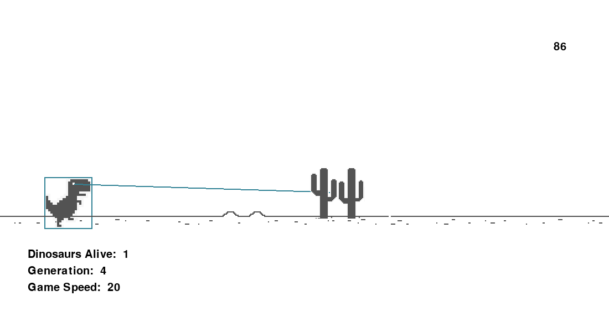

# Dino Game NEAT



This project is a Python-based clone of the Chrome Dino game, featuring an AI that learns to play using the NEAT (NeuroEvolution of Augmenting Topologies) algorithm.

The goal is to evolve agents capable of jumping over cacti and avoiding obstacles autonomously through generations of training.

## Features

- Dino game clone with Pygame
- NEAT algorithm for evolving neural networks
- Real-time visual feedback of training
- Configurable generation, mutation, and fitness parameters


## Requirements

- Python 3.10+
- Pygame
- NEAT-Python


## Build & Run

```bash
git clone https://github.com/jojorequiem/dino-game-neat.git
cd dino-game-neat
python3 -m venv .venv
source .venv/bin/activate
pip install -r requirements.txt
python main.py
````

